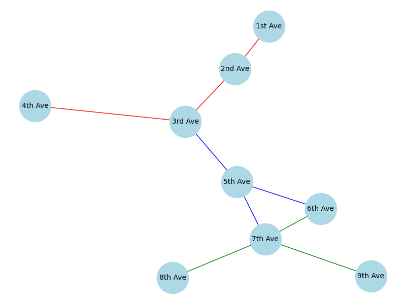
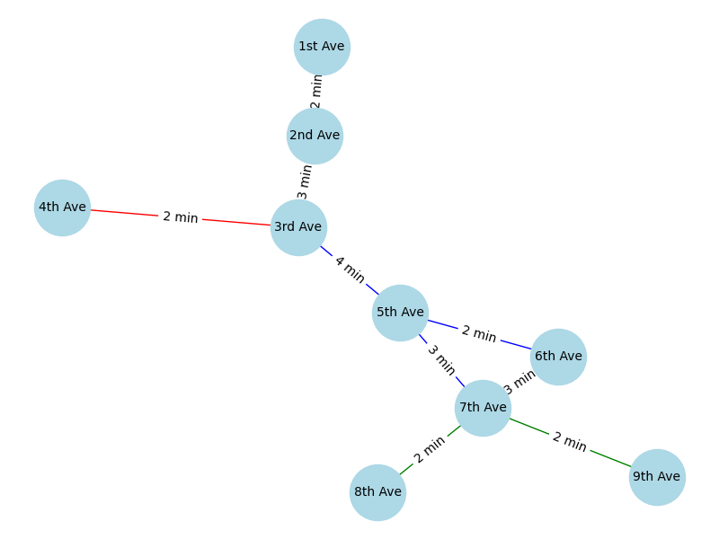

# NYC Metro Network Pathfinding

This project demonstrates the creation and analysis of a graph model for a simple network (the New York City metro system). It explores different pathfinding algorithms, such as Depth-First Search (DFS), Breadth-First Search (BFS), and Dijkstra’s algorithm to find the shortest path, and provides a comparison of their results.

## Task 1: Create and Visualize a Graph Model of a Real Network

The first task is to create a graph model representing the New York City metro system, where stations are represented as nodes, and metro lines are represented as edges. The graph is visualized to understand the structure of the network.

### Metro Lines and Stations

The following metro lines and stations are used in this project:

- **Red Line**: ["1st Ave", "2nd Ave", "3rd Ave", "4th Ave"]
- **Blue Line**: ["5th Ave", "6th Ave", "7th Ave", "8th Ave"]
- **Green Line**: ["3rd Ave", "5th Ave", "7th Ave", "9th Ave"]

### Visualization

The graph is visualized with the metro system as a network, with color-coded edges representing different metro lines.



## Task 2: Implement DFS and BFS Algorithms for Finding Paths

The second task involves implementing Depth-First Search (DFS) and Breadth-First Search (BFS) algorithms to find paths between stations in the metro network.

### DFS Pathfinding

DFS explores as deep as possible along each branch before backtracking. While it is guaranteed to find a path (if one exists), it can often result in longer or non-optimal paths.

- **DFS Path from "1st Ave" to "9th Ave"**:  
  `[1st Ave, 2nd Ave, 3rd Ave, 5th Ave, 6th Ave, 7th Ave, 9th Ave]`

### BFS Pathfinding

BFS explores all nodes at the present depth level before moving on to nodes at the next depth level. It is guaranteed to find the shortest path in terms of the number of edges.

- **BFS Path from "1st Ave" to "9th Ave"**:  
  `[1st Ave, 2nd Ave, 3rd Ave, 5th Ave, 7th Ave, 9th Ave]`

### Comparison of DFS and BFS

- **DFS**:  
  DFS may result in longer paths since it goes deeper into the graph before backtracking. It may not always find the shortest path.

- **BFS**:  
  BFS guarantees the shortest path in terms of the number of edges. It explores nodes level by level and reaches the goal using the least number of edges.

### Explanation of Algorithm Choices

Both algorithms produce the same path in this example, but the order of exploration and the traversal approach differ:

- **DFS** explores deeper into the graph before considering alternative paths.
- **BFS** systematically explores all neighboring stations at each level, ensuring the shortest path.

## Task 3: Add Weights to the Graph and Implement Dijkstra's Algorithm

In this task, we enhance the graph by adding weights to the edges to represent the distance or time between stations. We then implement Dijkstra’s algorithm to find the shortest path based on edge weights.

### Adding Weights to the Graph

Each connection between stations is assigned a weight representing the travel time between stations. These weights are arbitrary for this example but can be adjusted based on real-world data.

### Dijkstra's Algorithm

Dijkstra’s algorithm finds the shortest path in a weighted graph by iteratively selecting the node with the smallest tentative distance.

- **Dijkstra Path from "1st Ave" to "9th Ave"**:  
  `[1st Ave, 2nd Ave, 3rd Ave, 5th Ave, 7th Ave, 9th Ave]` (shortest path in terms of total weight)

### Visualizing the Weighted Graph

The graph is visualized with weights on the edges, and Dijkstra’s algorithm is used to find the shortest path based on these weights.



## Conclusions

- **DFS** explores deeply before backtracking, potentially resulting in longer or non-optimal paths.
- **BFS** ensures the shortest path in terms of the number of edges, making it more efficient when the goal is to minimize edge count.
- **Dijkstra’s Algorithm** optimizes for the shortest path based on edge weights, ensuring the most efficient route in terms of travel time or distance.

Each algorithm has its use case, with BFS and Dijkstra’s being preferable for finding optimal paths in terms of edge count and weight, respectively.

## Requirements

- Python 3.x
- NetworkX
- Matplotlib

## Setup

To run the project, install the necessary dependencies:

```bash
pip install networkx matplotlib
```
